# Build a 'try and buy' application with AR capabilities for a furniture store

Augmented Reality suits the furniture/interior business perfectly. It is also a fine tool for personalization of customer needs, especially when it comes to furniture/interior. Shoppers really want the ability to see how the items will look at their homes or offices. People want to see virtual interior design ideas in real time, and AR provides them with such ability.

This code pattern will enable developers to build powerful Augmented Reality applications for Android devices, with the help of Google ARCore SDK and `IBM Mobile Foundation`. To make the interior decorator application more immersive to the user, we will make use of open source 3D poly objects. In order to store all the product information, we will use `IBM Cloudant database`, which is a fully managed JSON document database that offers independent serverless scaling of provisioned throughput capacity and storage. And to retrieve the product information securely and display it dynamically in the mobile application, we will make use of `IBM Mobile Foundation`, which provides a rich set of back end capabilities for building, managing and updating your next gen cognitive, engaging, secure and personalized mobile and web applications.

In this code pattern, we will develop an android mobile application on `IBM Mobile Foundation` with AR capabilities that gives users the ability to select and place the furniture in their desired places, in real time.

<!--add an image in this path-->


<!--Optionally, add flow steps based on the architecture diagram-->
## Flow

1. User launches the mobile application.
2. Mobile application requests `IBM Mobile Foundation` for product details.
3. `IBM Mobile Foundation` fetches the product details from `Cloudant`.
4. Product details are displayed on the mobile application.
5. Users can now view how the furniture would look in their space.

## Demo
[](https://youtu.be/2qtWBiS-SD0)

## Pre-requisites

* [IBM Cloud account](https://www.ibm.com/cloud/) : Create an IBM Cloud account.
* [Java 1.8.x](https://adoptopenjdk.net/?variant=openjdk8&jvmVariant=openj9): Make sure you have required version (Java 1.8.x).
* Before you begin please note that this application uses AR-Core Library, and not all Android devices support AR-Core. To know which devices support AR-Core visit the [Supported Devices](https://developers.google.com/ar/discover/supported-devices) page.
* [Android Studio](https://developer.android.com/studio) : Download and Install Android Studio with SDK Version 26 or Above.

# Steps

Please follow the below to setup and run this code pattern.

1. [Clone the repo](#1-clone-the-repo)
2. [Create Cloudant database and populate it with sample data](#2-create-cloudant-database-and-populate-it-with-sample-data)
3. [Setup IBM Mobile Foundation Server & CLI, Build & Deploy Adapter](#3-setup-mobilefirst-foundation-server-&-cli,-build-&-deploy-adapter)
4. [Setup Poly Objects in Android Studio](#4-setup-poly-objects-in-android-studio)
5. [Run the Android App](#5-run-the-android-app)

### 1. Clone the repo

Clone this [git repo](https://github.com/IBM/augmented-reality-powered-interior-decorator).
Else, in a terminal, run:

```
$ git clone https://github.com/IBM/augmented-reality-powered-interior-decorator.git
```

### 2. Create Cloudant database and populate it with sample data

#### 2.1 Create Cloudant database

* Log in to [IBM Cloud Dashboard](https://cloud.ibm.com/).
* Open [*Cloudant NoSQL DB*](https://cloud.ibm.com/catalog/services/cloudant) service.
* In the `Available authentication methods` dropdown, select `Use both legacy credentials and IAM`.
* Click on `Create`.
* From the welcome page of Cloudant service that you just created, launch the Cloudant Dashboard.
* In the Cloudant Dashboard, click on `Databases`.
* Click on `Create Database`. Specify name of database as `mydatabase` as shown below. Click `Create`.

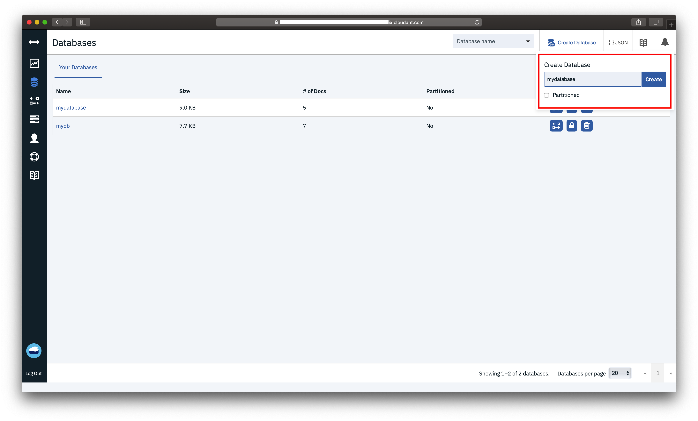

Once the database is created, the dashboard will update to show the documents inside `mydatabase` database (which, as expected, will be empty to begin with).

* Click `Create Document`. Under document content, after the auto populated `_id` field, enter product details as shown below. Please note that you need to put a comma (,) after the auto populated `_id` field.

<pre><code>
{
  "_id": "1c8cc4ad5ce9a1823434ebf9004e258e",
  "id": 1,
  "title": "Couch",
  "shortdesc": "Almost Black",
  "rating": 3.2,
  "price": 40000,
  "img": "black_sofa.png"
}
</code></pre>

Click `Create Document` to create/save the document.

* Repeat the above steps and create documents for the remaining sample products: [CloudantData/chair.json](CloudantData/chair.json), [CloudantData/corner_table.json](CloudantData/corner_table.json), [CloudantData/red_sofa.json](CloudantData/red_sofa.json), [CloudantData/table.json](CloudantData/table.json).

The `mydatabase` database should now list the five documents as shown below under `Table` view.

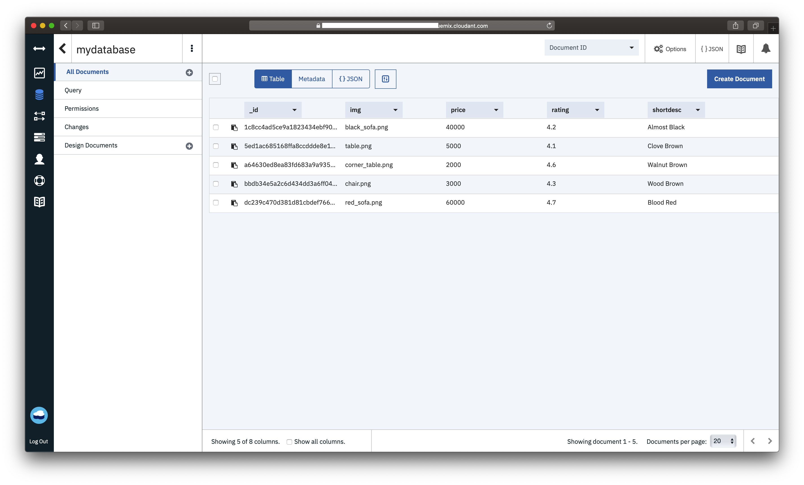

#### 2.2 Generate Cloudant API Key

 * In the Cloudant Dashboard, under `mydatabase` database, click on `Permissions` and then click on `Generate API Key` as shown in the snapshot below.
 * Make a note of the Key and Password generated.
 * The newly added key would get listed under Cloudant users with default permission of *reader* only. Select the checkbox under *writer* next to the new key to give it write permission as well.

  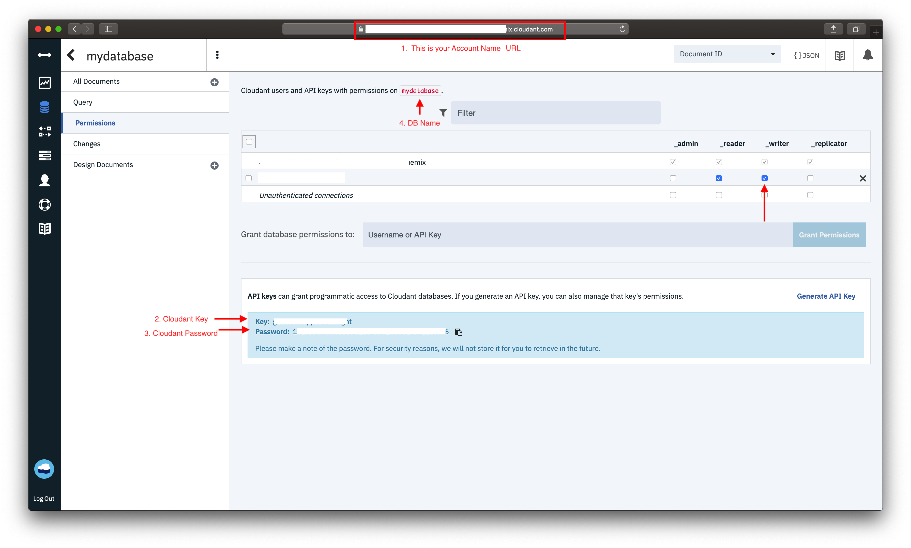

<b>Make a note of the following things as it will be used in step x.x:</b>

  | Sl no. | Note The Following  | Example |
  | -------------  | ------------- | ------------- |
  | 1. | Cloudant URL  | https://xxxx-xxx-xxxx-xxxx-xxxxx-bluemix.cloudant.com  |
  | 2. | Cloudant Key  | abcdefxyz1234  |
  | 3. | Cloudant Password  | 12345678abcd  |
  | 4. | DB Name  | mydatabase  |

### 3. Setup IBM Mobile Foundation Server & CLI, Build & Deploy Adapter

#### 3.1 Setup Ionic and MFP CLI

* Install `Node.js` by downloading the setup from https://nodejs.org/en/ (Node.js 8.x or above)
```
$ node --version
v10.15.0
```

* Install IBM Mobile Foundation Platform CLI
```
$ sudo npm install -g mfpdev-cli
$ mfpdev --version
8.0.0-2018121711
```

**Note**: If you are on Windows, instead of using `sudo`, run the above command without `sudo` in a command prompt opened in administrative mode.

> Note: While installing MFP CLI, if you hit an error saying `npm ERR! package.json npm can't find a package.json file in your current directory.`, then it is most likely due to [MFP CLI not being supported in your npm version](https://stackoverflow.com/questions/46168090/ibm-mobile-first-mfpdev-cli-installation-failure). In such a case, downgrade your npm as below, and then install MFP CLI.
`$ sudo npm install -g npm@3.10.10`

* Install Java SDK 8 from https://adoptopenjdk.net/?variant=openjdk8&jvmVariant=openj9
```
$ java -version
java version "1.8.0_101"
```
> Note: Java version `1.8.x` is required to build the Java Adapters. Do not Download Java version `11.x`. If you already have java version above `1.8.x` then you can follow the guide in `TROUBLESHOOTING.md` to uninstall the java and reinstall `1.8.x`.

* Install Maven:
On Mac, you can use `brew install` for installing Maven as shown below:
```
$ /usr/bin/ruby -e "$(curl -fsSL https://raw.githubusercontent.com/Homebrew/install/master/install)"
$ brew install maven
$ mvn --version
Apache Maven 3.6.0 ...
```
On Windows, you can follow this [Tutorial](https://www.mkyong.com/maven/how-to-install-maven-in-windows/) to install Maven.

#### 3.2 Create Mobile Foundation service and configure MFP CLI
* In the [IBM Cloud Dashboard](https://cloud.ibm.com/),open [Mobile Foundation](https://cloud.ibm.com/catalog/services/mobile-foundation). Click on `Create` as shown below.

  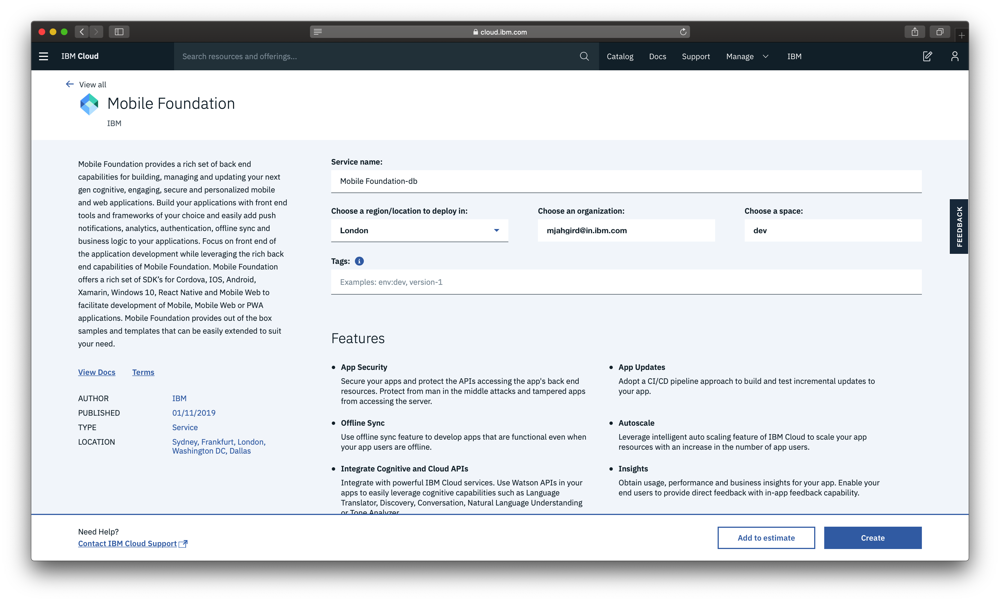

* In the Mobile Foundation service overview page that gets shown, click on `Service credentials`. Expand `View credentials` and make a note of the `url`, `user` and `password` as shown below.

  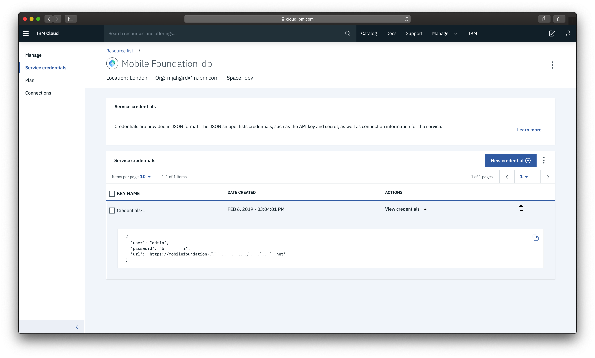

>NOTE: The `user`, `password` and `url` is Important as it will be used in subsequent steps.

<b>NOTE: Make Sure the Cloud Foundry App for Mobile Foundation-Server gets at least `768MB` of Memory.(Recommended is 1GB) You can verify it by going to `IBM Cloud Dashboard > Resources > Cloud Foundry Apps > MobileFoundation-Server` as shown below.</b>

  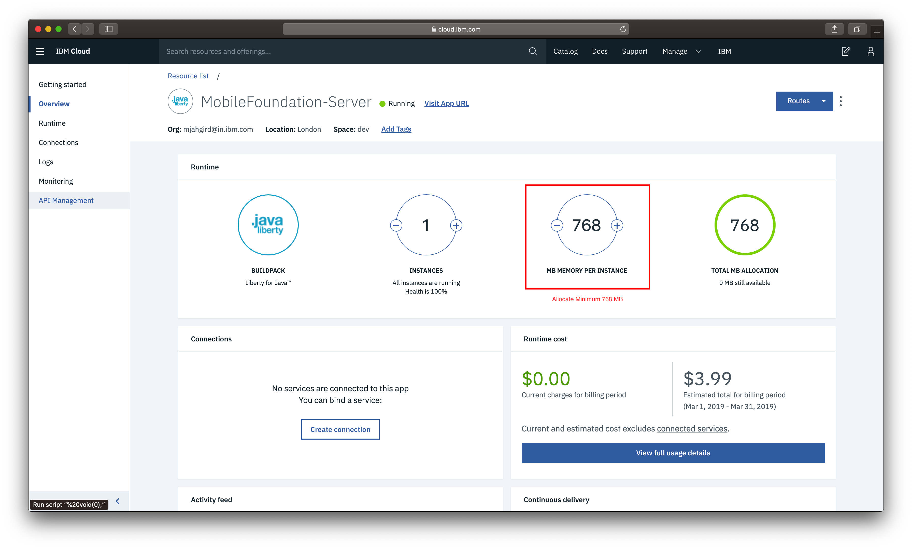

> Note: If *Mobile Foundation* service is not available with your current account type, then you can:
> - Upgrade your account, and avail the *Mobile Foundation* service's free Developer plan which allows the use of the service free for up to ten daily client devices for development and testing activities.

* Back on your local machine, configure MFP CLI to work with Mobile Foundation server by running the following command in console.

> Note: For `Enter the fully qualified URL of this server:`, enter the `url` mentioned in credentials followed by `:443` (the default HTTPS port).
```
$ mfpdev server add
```

* Follow the Instructions.
```
? Enter the name of the new server profile: MyServer
? Enter the fully qualified URL of this server: https://mobilefoundation-xxxx-xxxxx.xx-xx.mybluemix.net:443
? Enter the Mobile Foundation Server administrator login ID: admin
? Enter the Mobile Foundation Server administrator password: **********
? Save the administrator password for this server?: Yes
? Enter the context root of the Mobile Foundation administration services: mfpadmin
? Enter the Mobile Foundation Server connection timeout in seconds: 30
? Make this server the default?: Yes
Verifying server configuration...
The following runtimes are currently installed on this server: mfp
Server profile 'MyServer' added successfully.
```
* Next Verify If the Server is added.
```
$ mfpdev server info
Name         URL
---------------------------------------------------------------------------------------
MyServer  https://mobilefoundation-xxxx-xxxxxx.xx-xx.mybluemix.net:443  [Default]
---------------------------------------------------------------------------------------
```
>Note: If this step fails check `TROUBLESHOOTING.md` to fix commonly occuring errors.


#### 3.3 Deploy the MFP Adapter and Test it
##### 3.3.1 Build and Deploy the MFP adapters
* Go to the `CloudantJava` directory.

```
$ cd /CloudantJava
```
* Add the `URL` along with the port number `:443` appended with `/mfpadmin`, `User` and `Password` in the `pom.xml` file which is present in `CloudantJava` directory as show bellow.

<pre><code>
...
<b>&lt;mfpfUrl&gt;https://mobilefoundation-xxxx-xxxxxx.xx-xx.mybluemix.net:443/mfpadmin &lt;/mfpfUrl&gt;</b>
<b>&lt;mfpfUser&gt;admin &lt;/mfpfUser&gt;</b>
<b>&lt;mfpfPassword&gt;******** &lt;/mfpfPassword&gt;</b>
&lt;mfpfRuntime&gt;mfp &lt;/mfpfRuntime&gt;
...
</code></pre>

* Build the `CloudantJava` adapter as shown below.
```
$ mfpdev adapter build
Building adapter...
Successfully built adapter
```
* Deploy the adapter as shown bellow.
```
$ mfpdev adapter deploy
Verifying server configuration...
Deploying adapter to runtime mfp on https://mobilefoundation-xxxx-xxxxxx.xx-xx.mybluemix.net:443/mfpadmin...
Successfully deployed adapter
```

> Note: In [Step 3.2], if you specified `No` to `Make this server the default?`, then you need to specify the name of your server profile (`MyServer` in our case) at the end of `mfpdev adapter deploy` command as shown below.
```
$ mfpdev adapter deploy MyServer
```
##### 3.3.2 Launch MFP dashboard and update adapter configurations
Launch MFP Dashboard as below:
  * In the [IBM Cloud dashboard](https://cloud.ibm.com/dashboard/), under `Cloud Foundry Services`, click on the `Mobile Foundation` service you created in [Step 3.2]. The service overview page that gets shown, will have the MFP dashboard embedded within it. You can also open the MFP dashboard in a separate browser tab by appending `/mfpconsole` to the *url* `https://mobilefoundation-xxxx-xxxxx.xx-xx.mybluemix.net`.
>Example: `https://mobilefoundation-xxxx-xxxxx.xx-xx.mybluemix.net/mfpconsole`

> NOTE: `username` & `password` can be found in `Service credentials` in step 3.2.
  * Inside the MFP dashboard, in the list on the left, you will see the `CloudantJava` adapter listed.

Update MFP Adapter configuration as below:
  * Inside the MFP dashboard, click on the `CloudantJava` adapter. Under `Configurations` tab, you should see the various properties for accessing Cloudant DB as shown below.

     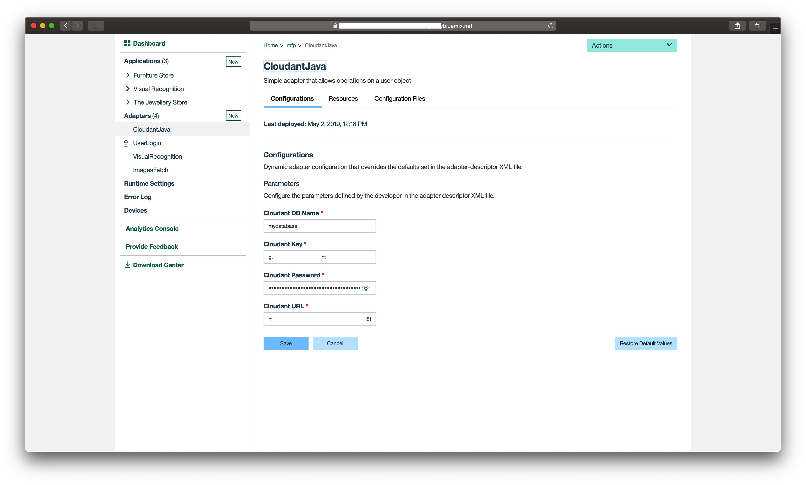

  * All these properties can be found in step 2.2.

  * Save the changes by clicking `Save`.

  * Click on `Resources` tab. You should see the various REST APIs exposed by `CloudantJava` adapter as shown below.

     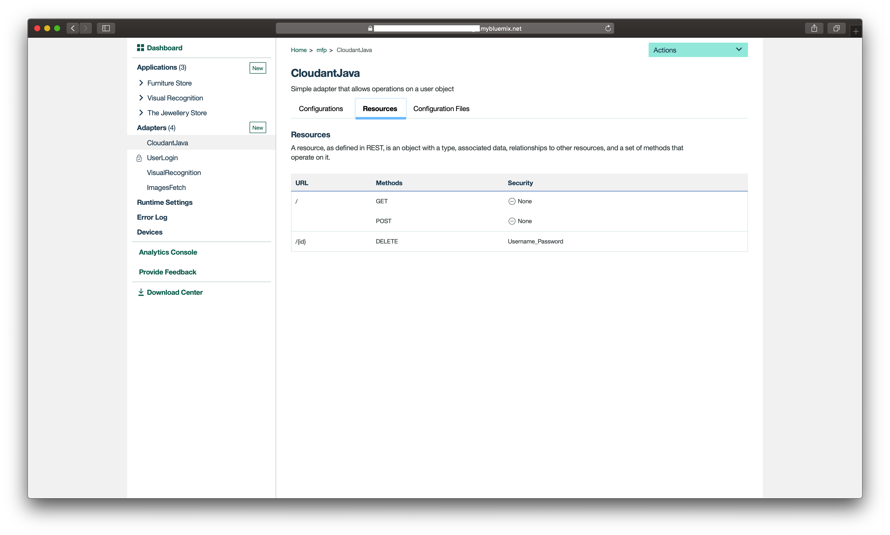

##### 3.3.3 Test the CloudantJava adapter
To Test the adapter use any REST Clients like [Postman](https://www.getpostman.com/downloads/).
After Installing postman type the `url` created in [step 3.2] and append it with `/mfp/api/adapters/CloudantJava/`.

>Example: `https://mobilefoundation-xxxx-xxxxxx.xx-xx.mybluemix.net/mfp/api/adapters/CloudantJava/`.

 * Now click on `Send` button to run the GET `/mfp/api/adapters/CloudantJava/` API. The API response should get shown in the `Response Body` as shown in snapshot below.

 * The GET API on `/mfp/api/adapters/CloudantJava/` should return a JSON object containing `_id`, `_rev`, `id`, `title`, `shortdesc`, `rating`, `price` & `img` from your Cloudant as shown below.

    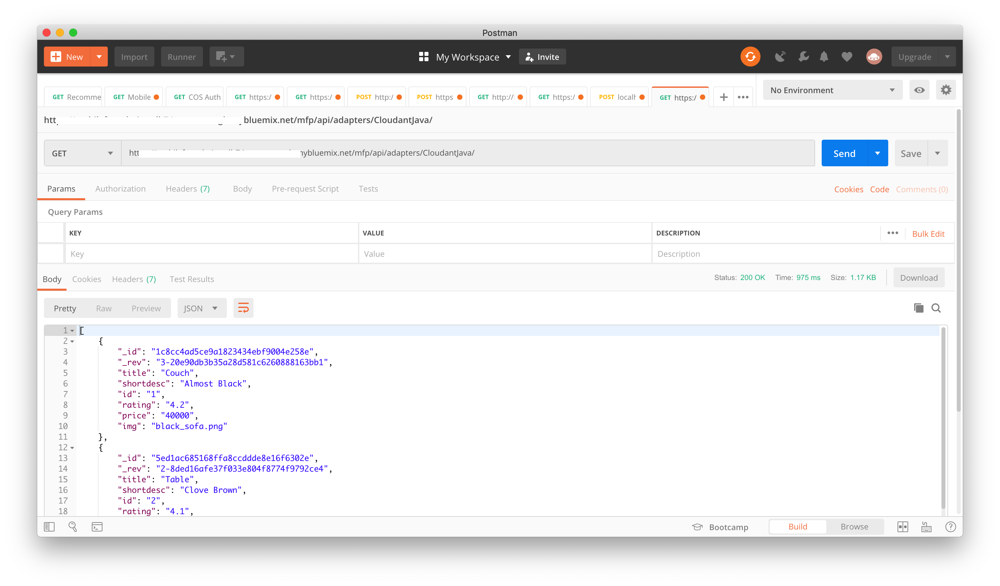

  At this point you have successfully configured the Cloudant and Mobile Foundation.

### 4. Setup Poly Objects in Android Studio
#### 4.1 Google Sceneform Tools Setup
* Open the directory `FurnitureStoreApp` in Android Studio.

* In Android Studio goto `File > Preferences > Plugins` and click on `Browse Repositories` button.

* Search for the keyword `sceneform` and install it as shown.

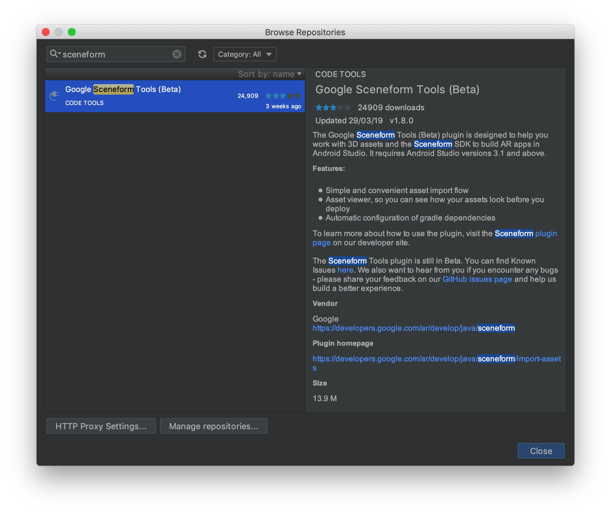


* Click on `Build > Make Project` to build the android project.

>NOTE: The Initial Gradle Build may take much longer time please be patient.

#### 4.2 Importing Google Poly Objects into Android Studio

* Download the poly objects from the bellow URL's.
    1. Chair by Google: https://poly.google.com/view/13AL0KYItKD
    
    >> ["Chair"](https://poly.google.com/view/13AL0KYItKD) by [poly by google](https://poly.google.com/user/4aEd8rQgKu2) is licensed under [CC-BY 3.0](https://creativecommons.org/licenses/by/3.0/legalcode)
    
    2. Table by Google: https://poly.google.com/view/8cnrwlAWqx7
    
    >> ["Table"](https://poly.google.com/view/8cnrwlAWqx7) by [poly by google](https://poly.google.com/user/4aEd8rQgKu2) is licensed under [CC-BY 3.0](https://creativecommons.org/licenses/by/3.0/legalcode)
    
    3. Sofa by Google: https://poly.google.com/view/bwd4gui4RZ4
    
    >> ["Sofa"](https://poly.google.com/view/bwd4gui4RZ4) by [poly by google](https://poly.google.com/user/4aEd8rQgKu2) is licensed under [CC-BY 3.0](https://creativecommons.org/licenses/by/3.0/legalcode)
    
    4. Vintage Corner Table by Danny Bittman: https://poly.google.com/view/7IxmR5JQXyC
    
    >> ["Vintage Corner Table"](https://poly.google.com/view/7IxmR5JQXyC) by [Danny Bittman](https://poly.google.com/user/axCOZrx3oD3) is licensed under [CC-BY 3.0](https://creativecommons.org/licenses/by/3.0/legalcode)
    
    5. Couch | Wde by Danny Bittman: https://poly.google.com/view/7Q_Ab2HLll1
    
    >> ["Couch"](https://poly.google.com/view/7Q_Ab2HLll1) by [Danny Bittman](https://poly.google.com/user/axCOZrx3oD3) is licensed under [CC-BY 3.0](https://creativecommons.org/licenses/by/3.0/legalcode)

1. Extract the `.zip` files.

2. In Android Studio, in the left panel right click and select `New > Sample Data Directory` as shown.

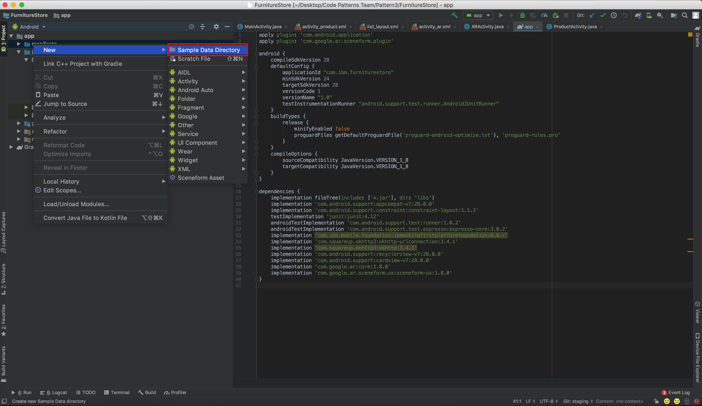

3. Right click on the newly created `sampledata` directory and select `Reveal in Finder` for Mac.
>On Windows Right click on the newly created `sampledata` directory and select `Show in Explorer`.

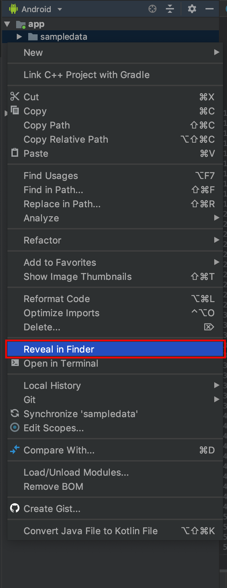

4. Rename the directories and `.obj` files which were extracted from the `.zip` as shown.

    <b>NOTE: Rename as exact same names as shown else the app wont work</b>

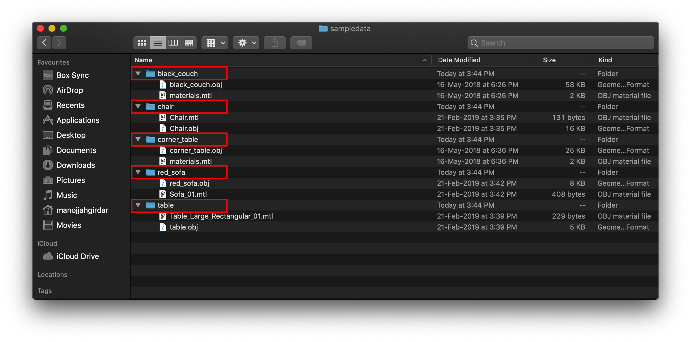

5. Now copy paste it in the `sampledata` directory.

6. Back to Android Studio, go to `sampledata > black_couch` and right click on `black_couch.obj` file and select `Import Sceneform Asset` as shown.

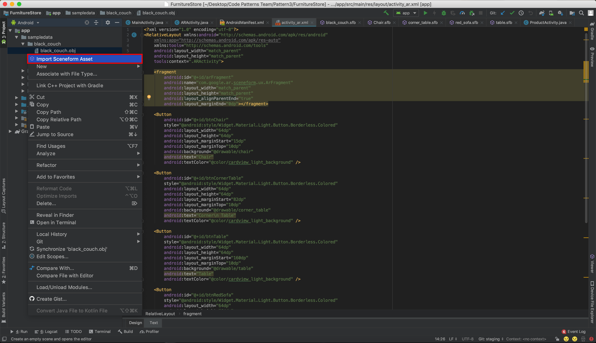

7. You will get an Import Wizard, make sure the `.sfa output path` name and `.sfb output path` name is same as the file name as shown.

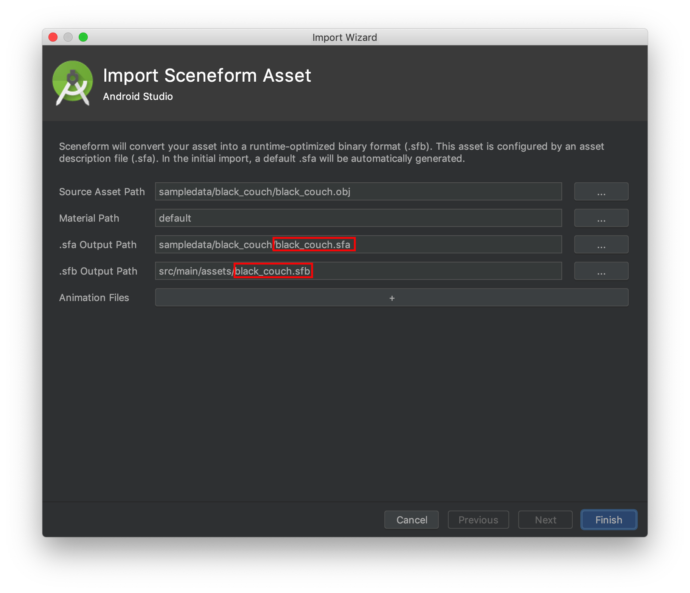

* Click on `Finish`.

8. Wait for the Gradle Build to finish. Upon Successful build you will see the poly image on your screen as shown.

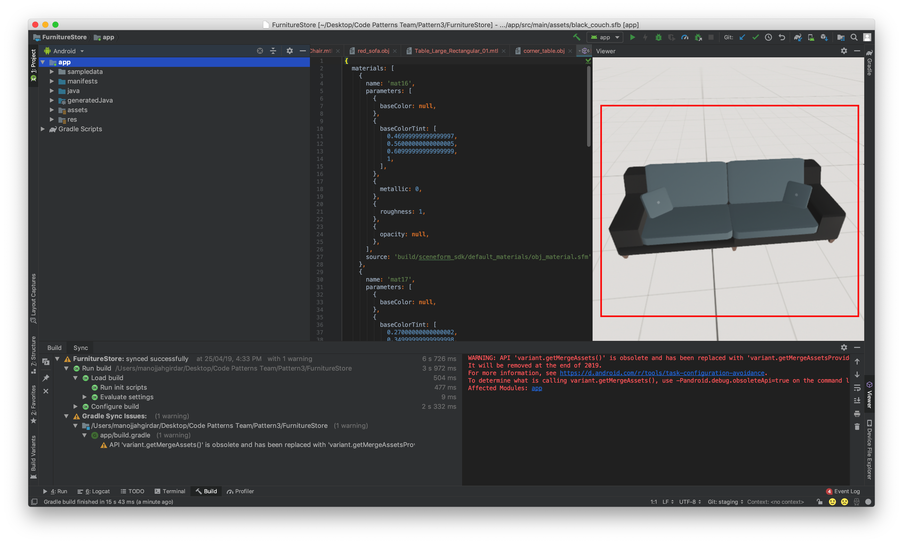

* Now repeat Step 6 to Step 8 for `Chair`, `corner_table`, `red_sofa` & `table`.

* Once you have Imported all 5 Sceneforms you can go to `assets` directory in the android studio to view it as shown.

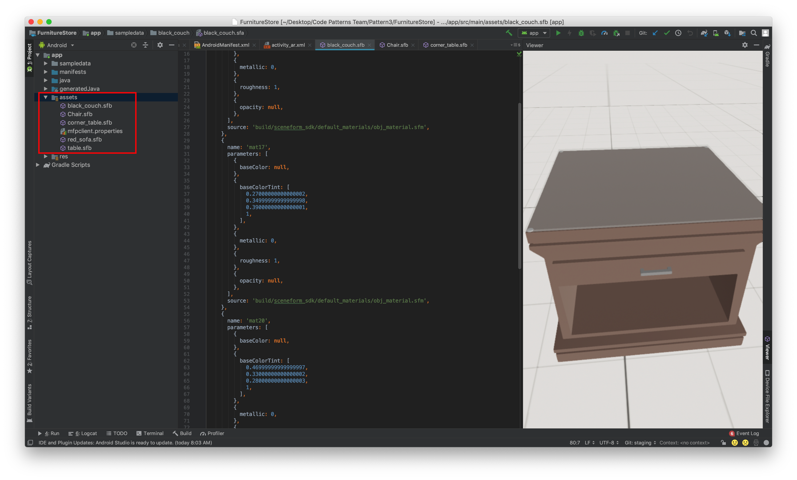

#### 4.3 Resizing the Poly Objects
Once the Poly Objects are loaded into android studio, the size of each poly object is not uniform. Follow the below steps to calibrate the size of each poly object.

* In Android Studio under `assets` directory double click on <b>`black_couch.sfb`</b>.

* In the code window, scroll to the bottom of the window and add the following scale value to <b>`scale: 1.75`</b>.
<pre><code>
...

model: {
    attributes: [
      'Position',
      'Orientation',
    ],
    collision: {},
    file: 'sampledata/black_couch/black_couch.obj',
    name: 'black_couch',
    recenter: 'root',
    <b>scale: 1.75,</b>
  },
  version: '0.54:2',
}
</code></pre>

* Similarly under `assets` directory double click on <b>`Chair.sfb`</b> and set the scale value to <b>`scale: 0.075`</b>, for <b>`corner_table.sfb`</b> set the scale value to <b>`scale: 0.2`</b>, for <b>`red_sofa.sfb`</b> set the scale value to <b>`scale: 0.09`</b> and for <b>`table.sfb`</b> set the scale value to <b>`scale: 0.095`</b>.

    | Poly Objects  | Scale Size |
    | ------------- | ------------- |
    | black_couch.sfb  | 1.75  |
    | Chair.sfb  | 0.075  |
    | corner_table.sfb  | 0.2  |
    | red_sofa.sfb  | 0.09  |
    | table.sfb  | 0.095  |

### 5. Run the Android App
At this point you will have setup Cloudant DB, Mobile Foundation Server for the Application and setup the Poly Objects in Android Studio. One last thing before you run the android app is to register the application to Mobile Foundation Server so that it can make necessary API calls to Cloudant.

#### 5.1 Register the Android App to IBM Mobile Foundation
* On the Commandline, enter the following command to register the app to Mobile Foundation server.
```
$ mfpdev app register
Verifying server configuration...
Registering to server:'https://mobilefoundation-xxxx-xxxxx.xx-xx.mybluemix.net:443' runtime:'mfp'
Registered app for platform: android
```

> Note: In [Step 3.2], if you specified `No` to `Make this server the default?`, then you need to specify the name of your server profile (`MyServer` in our case) at the end of `mfpdev app deploy` command as shown below.
`$ mfpdev app register MyServer`

#### 5.2 Build/Run the Android App
* Install Android SDK Platform 24 (or higher) as below:
  - Launch Android Studio.
  - Click on `Configure` -> `SDK Manager`.
  - Under `SDK Platforms`, select `Android 7.0 (Nougat) API Level 24` or higher. Click `Apply` and then click `OK`. This will install Android SDK Platform on your machine.

* Enable USB debugging on your Android phone as per the steps in https://developer.android.com/studio/debug/dev-options
  - Launch the Settings app on your phone. Select `About Device` -> `Software Info`. Tap `Build number` 7 times to enable developer options.
  - Return to Settings list. Select `Developer options` and enable `USB debugging`.
* If you are developing on Windows, then you need to install the appropriate USB driver as per instructions in https://developer.android.com/studio/run/oem-usb.
* Connect the Android phone to your development machine by USB cable, you will get a prompt displaying adb access required, `allow` the access.

> Note: If you have android [adb tools](https://developer.android.com/studio/command-line/adb) you can check whether your device is connected or not by entering `adb devices`.

* Open the directory `FurnitureStore` in Android Studio, click on `run > run 'app'`.

* Connect the android device to the deployment machine it will be displayed on the screen. Select that and click `ok`.

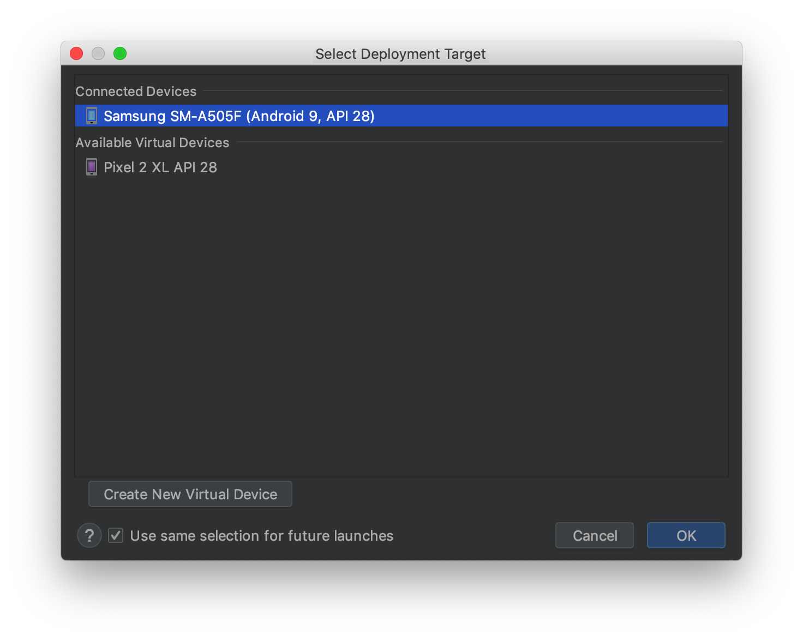

> Note: You will get a prompt displaying adb access required, `allow` the access only then the device will be shown in the above window.

* Wait for Gradle to finish the build and install the Apk on your android device.

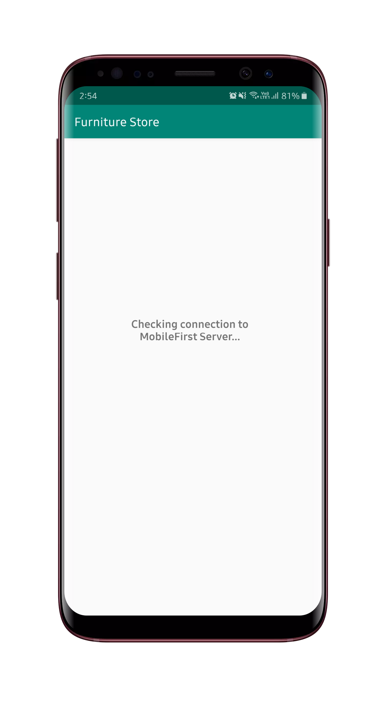

* The App first pings the Mobile Foundation Server and checks if it is registered.

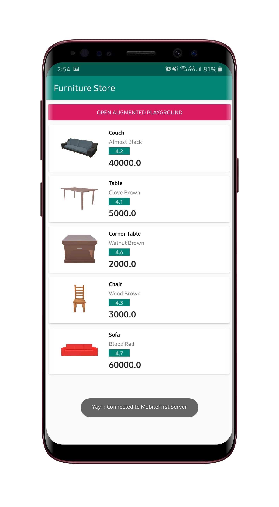

* Then the app makes api call to cloudant to fetch the product data and display it.

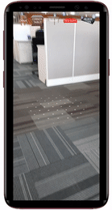

* Finally you can click on `Open Augmented Playground` to launch the AR screen on which you can choose the product and click on the anchors to place the object.

>>For a similar retail pattern, check out [Integrate a virtual mirror for e-commerce products](https://developer.ibm.com/patterns/integrate-a-virtual-mirror-with-e-commerce-products/).

>> To explore more on Argument Reality, refer to our argument reality related patterns at https://developer.ibm.com/patterns/category/virtual-reality/.

# Troubleshooting

Please see [troubleshooting guide](TROUBLESHOOTING.md) for solutions to some commonly occuring problems.

* Click on the `Logcat` button at the bottom of the screen in Android Studio to see the console log outputs by the application as shown.

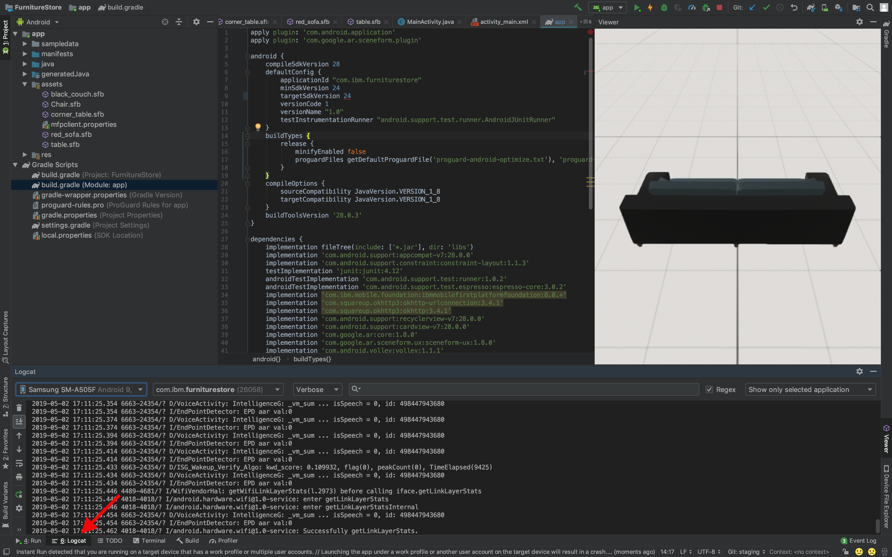

* You can see the console logs here for every action that the app performs.

## License


This code pattern is licensed under the Apache License, Version 2. Separate third-party code objects invoked within this code pattern are licensed by their respective providers pursuant to their own separate licenses. Contributions are subject to the [Developer Certificate of Origin, Version 1.1](https://developercertificate.org/) and the [Apache License, Version 2](https://www.apache.org/licenses/LICENSE-2.0.txt).

[Apache License FAQ](https://www.apache.org/foundation/license-faq.html#WhatDoesItMEAN)
